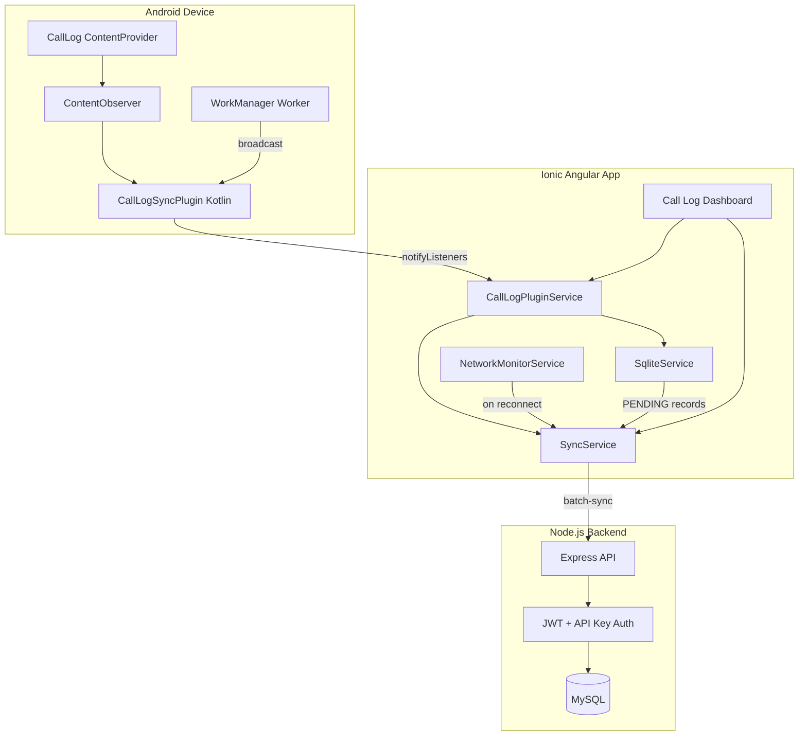
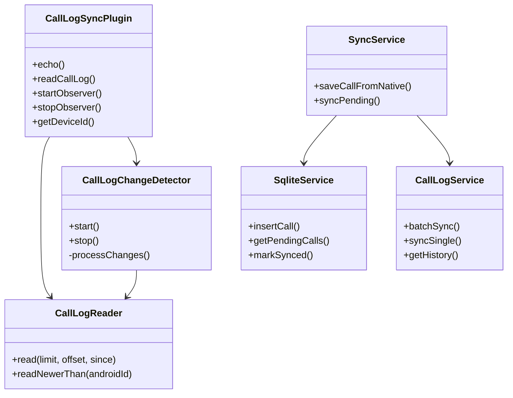
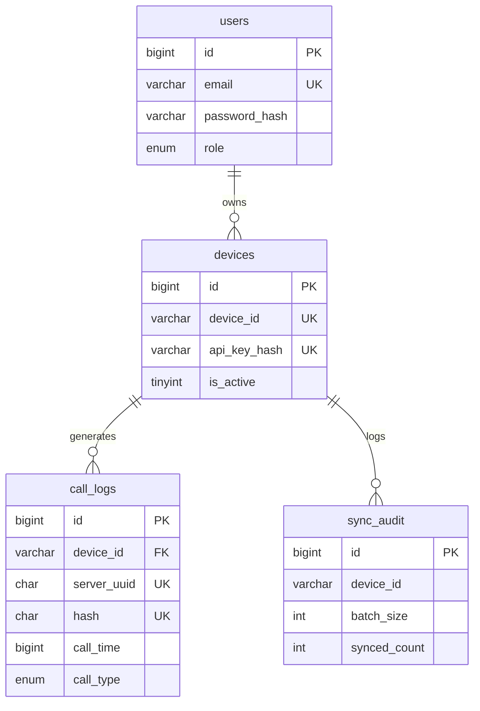
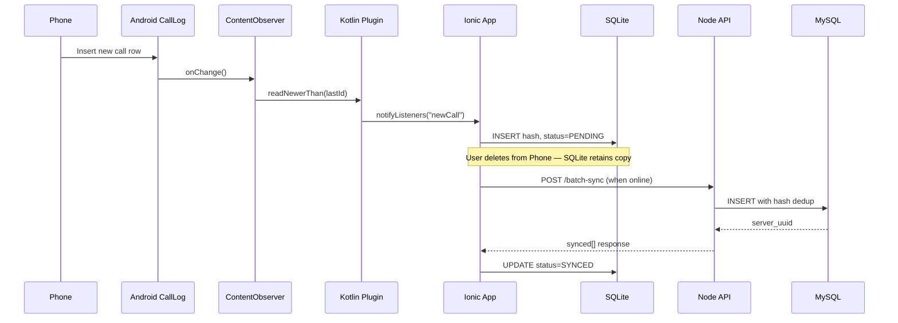

# System Architecture

## Component Diagram



## Class Diagram (Simplified)



## ER Diagram



## Data Flow



## Folder Structure

```
call-log-sync-system/
├── call-log-app/                    # Ionic Angular host
│   └── src/app/
│       ├── core/
│       │   ├── models/              # TypeScript interfaces
│       │   └── services/            # SQLite, Sync, API, Auth
│       └── features/
│           └── call-log/            # Dashboard UI
├── call-log-sync-plugin/            # Capacitor plugin
│   ├── src/                         # TS bridge (definitions, index)
│   └── android/src/main/java/       # Kotlin native code
├── call-log-backend/                # Node.js API
│   ├── migrations/                  # MySQL schema
│   └── src/                         # Express routes, services
└── docs/                            # Module documentation
```
