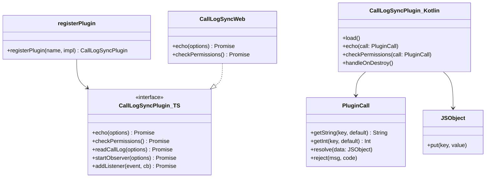
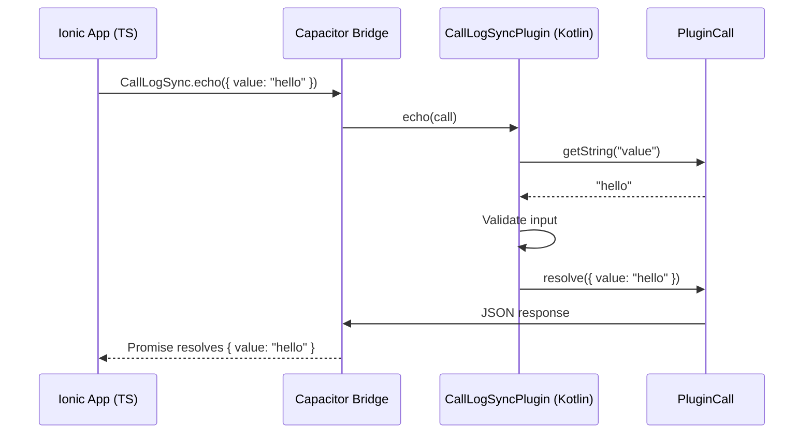

# Part 1 — Capacitor Plugin Fundamentals

> **Module Status:** ✅ Complete  
> **Next Module:** Part 2 — Android / Kotlin Basics (awaiting your confirmation)

---

## Table of Contents

1. [What is a Capacitor Plugin?](#1-what-is-a-capacitor-plugin)
2. [How Capacitor Communicates with Android](#2-how-capacitor-communicates-with-android)
3. [Core Bridge Concepts](#3-core-bridge-concepts)
4. [Project Structure Explained](#4-project-structure-explained)
5. [File-by-File Walkthrough](#5-file-by-file-walkthrough)
6. [Registration Flow](#6-registration-flow)
7. [Architecture Diagrams](#7-architecture-diagrams)
8. [Hands-On: Echo Test](#8-hands-on-echo-test)

---

## 1. What is a Capacitor Plugin?

A **Capacitor Plugin** is a bridge that lets your Ionic/Angular app (JavaScript/TypeScript) talk to **native Android code** (Kotlin).

```
┌─────────────────────────────────────────────────────────┐
│                    YOUR IONIC APP                        │
│  TypeScript: CallLogSync.readCallLog()                  │
└────────────────────────┬────────────────────────────────┘
                         │ Capacitor Bridge (JSON)
┌────────────────────────▼────────────────────────────────┐
│              CAPACITOR RUNTIME (WebView)                 │
│  Serializes JS calls → dispatches to native plugin       │
└────────────────────────┬────────────────────────────────┘
                         │ JNI / Android IPC
┌────────────────────────▼────────────────────────────────┐
│           NATIVE ANDROID PLUGIN (Kotlin)                 │
│  @PluginMethod fun readCallLog(call: PluginCall)        │
│  Queries Android CallLog ContentProvider                 │
└─────────────────────────────────────────────────────────┘
```

### Why do we need a plugin?

| Task | Can JavaScript do it? | Needs Native Plugin? |
|------|----------------------|---------------------|
| Display a list in Ionic UI | ✅ Yes | No |
| Read Android Call Log | ❌ No | **Yes** |
| Listen to ContentObserver | ❌ No | **Yes** |
| Request Android permissions | ❌ No | **Yes** |
| Run WorkManager background job | ❌ No | **Yes** |

JavaScript in a WebView **cannot** access Android system APIs directly. The plugin is the authorized gateway.

### Capacitor vs Cordova

| Feature | Cordova (old) | Capacitor (modern) |
|---------|--------------|-------------------|
| Bridge | Callback-based | Promise-based |
| Native language | Java (default) | Kotlin/Java/Swift |
| Plugin creation | `plugin.xml` required | Gradle + annotations |
| Type safety | Weak | Strong (TypeScript definitions) |
| Maintenance | Declining | Active (Ionic team) |

**We use Capacitor** — it is the current standard for Ionic native development.

---

## 2. How Capacitor Communicates with Android

### The Bridge Architecture

```
Ionic App (TypeScript)
        │
        │  1. CallLogSync.echo({ value: "hello" })
        ▼
registerPlugin('CallLogSync')          ← index.ts
        │
        │  2. Capacitor serializes to JSON:
        │     { "pluginId": "CallLogSync", "methodName": "echo", "options": { "value": "hello" } }
        ▼
Capacitor WebView Bridge               ← @capacitor/core
        │
        │  3. Android WebView calls native handler
        ▼
Bridge.execute(PluginCall)             ← Capacitor Android runtime
        │
        │  4. Finds plugin by name "CallLogSync"
        │  5. Invokes @PluginMethod echo()
        ▼
CallLogSyncPlugin.echo(call)           ← Your Kotlin code
        │
        │  6. call.resolve(JSObject) → JSON response
        ▼
Promise resolves in TypeScript         ← { value: "hello" }
```

### Communication is ALWAYS asynchronous

Even if Kotlin executes in 1ms, the bridge is **async**. Every plugin method returns a `Promise` on the Ionic side.

```typescript
// ✅ Correct — await the Promise
const result = await CallLogSync.echo({ value: 'test' });

// ❌ Wrong — result is a Promise object, not the value
const result = CallLogSync.echo({ value: 'test' });
console.log(result.value); // undefined!
```

### Data format: JSON only

The bridge only transfers **JSON-serializable** data:
- ✅ string, number, boolean, array, object
- ❌ File, Bitmap, Cursor, custom Kotlin classes

Native code must convert Android objects → `JSObject` before sending to Ionic.

---

## 3. Core Bridge Concepts

### 3.1 PluginMethod

`@PluginMethod` is a Kotlin annotation that **exposes** a function to JavaScript.

```kotlin
@PluginMethod
fun echo(call: PluginCall) {
    val value = call.getString("value", "")
    val result = JSObject()
    result.put("value", value)
    call.resolve(result)  // ← completes the JS Promise
}
```

**Rules:**
- Must be `public`
- Must accept exactly one `PluginCall` parameter
- Must call `call.resolve()` OR `call.reject()` — never leave a call hanging
- Method name in Kotlin = method name in TypeScript (camelCase)

### 3.2 PluginCall

`PluginCall` represents **one request** from Ionic to native.

```kotlin
// Read arguments sent from Ionic
val limit = call.getInt("limit", 50)           // number
val since = call.getLong("since", 0L)          // long
val phone = call.getString("phoneNumber", "")  // string
val flag = call.getBoolean("force", false)     // boolean
val data = call.getObject("options")           // nested JSObject

// Respond to Ionic
call.resolve(result)                           // success → .then()
call.reject("Error message", "ERROR_CODE")     // failure → .catch()
```

**Critical rule:** Every `PluginCall` must be resolved or rejected. Unresolved calls cause memory leaks and hung Promises.

### 3.3 PluginResult (via JSObject + resolve/reject)

Capacitor does not use a separate `PluginResult` class on Android. Instead:

| Action | Kotlin | Ionic receives |
|--------|--------|----------------|
| Success | `call.resolve(jsObject)` | `Promise.resolve(data)` |
| Error | `call.reject(msg, code)` | `Promise.reject({ message, code })` |

```typescript
// Ionic error handling
try {
  const calls = await CallLogSync.readCallLog({ limit: 50 });
} catch (error) {
  if (error.code === 'PERMISSION_DENIED') {
    await CallLogSync.requestPermissions();
  }
}
```

### 3.4 notifyListeners (Events: Native → Ionic)

`PluginMethod` = Ionic calls native (request/response).  
`notifyListeners` = native pushes events to Ionic (no request needed).

```kotlin
// Kotlin — when ContentObserver detects a new call (Part 4/5)
val callData = JSObject()
callData.put("phoneNumber", "+919876543210")
callData.put("callType", "INCOMING")
notifyListeners("newCall", callData)  // ← pushes event to Ionic
```

```typescript
// Ionic — listen for events
const handle = await CallLogSync.addListener('newCall', (call: CallLogEntry) => {
  console.log('New call detected:', call.phoneNumber);
  // Save to SQLite with sync_status = PENDING
});

// Cleanup when component destroys
handle.remove();
```

**Event flow (opposite direction of PluginMethod):**

```
Android ContentObserver detects change
        │
        ▼
Kotlin: notifyListeners("newCall", data)
        │
        ▼
Capacitor Bridge (JSON event)
        │
        ▼
Ionic: addListener('newCall', callback) fires
```

---

## 4. Project Structure Explained

### Full Monorepo Layout

```
call-log-sync-system/
│
├── call-log-app/                    # IONIC ANGULAR HOST APP
│   ├── src/
│   │   ├── app/
│   │   │   ├── core/                # Singleton services (DI)
│   │   │   │   ├── services/
│   │   │   │   │   ├── call-log-plugin.service.ts   (Part 5)
│   │   │   │   │   ├── sqlite.service.ts            (Part 6)
│   │   │   │   │   ├── sync.service.ts              (Part 8)
│   │   │   │   │   ├── api.service.ts               (Part 11)
│   │   │   │   │   └── auth.service.ts              (Part 13)
│   │   │   │   └── models/
│   │   │   │       └── call-log.model.ts
│   │   │   ├── features/
│   │   │   │   └── call-log/
│   │   │   │       ├── call-log.page.ts
│   │   │   │       └── call-log.page.html
│   │   │   └── home/
│   │   ├── assets/
│   │   └── environments/
│   ├── android/                     # Generated by `npx cap add android`
│   ├── www/                         # Built Angular app (webDir)
│   ├── capacitor.config.ts
│   └── package.json
│
├── call-log-sync-plugin/            # CAPACITOR PLUGIN
│   ├── src/                         # TypeScript bridge layer
│   │   ├── definitions.ts           # API contract (interfaces)
│   │   ├── index.ts                 # Plugin registration
│   │   └── web.ts                   # Browser fallback stub
│   ├── android/                     # Kotlin native layer
│   │   ├── build.gradle
│   │   ├── src/main/
│   │   │   ├── AndroidManifest.xml  # Permissions
│   │   │   └── java/.../CallLogSyncPlugin.kt
│   │   └── proguard-rules.pro
│   ├── dist/                        # Built output (after npm run build)
│   ├── package.json
│   ├── tsconfig.json
│   └── rollup.config.mjs
│
├── call-log-backend/                # NODE BACKEND (Part 11)
│   ├── src/
│   ├── prisma/ or migrations/
│   └── package.json
│
└── docs/                            # Module documentation
    ├── PART-01-CAPACITOR-PLUGIN.md  ← You are here
    ├── PART-02-ANDROID-BASICS.md
    └── ...
```

### Plugin Folder Deep Dive

```
call-log-sync-plugin/
│
├── src/                    ← JAVASCRIPT/TYPESCRIPT LAYER
│   ├── definitions.ts      ← Contract: what methods/events exist
│   ├── index.ts            ← registerPlugin() — entry point
│   └── web.ts              ← Browser stub (for ionic serve)
│
├── android/                ← NATIVE ANDROID LAYER
│   ├── build.gradle        ← Android library build config
│   ├── proguard-rules.pro  ← Code shrinking rules for release
│   └── src/main/
│       ├── AndroidManifest.xml  ← Permissions (merged into app)
│       └── java/com/.../CallLogSyncPlugin.kt  ← Native implementation
│
├── dist/                   ← BUILD OUTPUT (published to npm)
│   ├── esm/                ← ES Modules + .d.ts type files
│   ├── plugin.js           ← IIFE bundle (script tag)
│   └── plugin.cjs.js       ← CommonJS bundle
│
├── package.json            ← npm metadata + build scripts
├── tsconfig.json           ← TypeScript compiler config
└── rollup.config.mjs       ← Bundler config (creates dist/)
```

---

## 5. File-by-File Walkthrough

### 5.1 `package.json` (Plugin)

```json
{
  "name": "call-log-sync",           // npm package name
  "main": "dist/plugin.cjs.js",      // Entry for Node/CommonJS
  "module": "dist/esm/index.js",     // Entry for ES Modules (Ionic uses this)
  "types": "dist/esm/index.d.ts",    // TypeScript type definitions
  "capacitor": {
    "android": { "src": "android" }  // Tells Capacitor where native code lives
  }
}
```

**Key scripts:**
| Script | Purpose |
|--------|---------|
| `npm run build` | Compile TypeScript → bundle with Rollup |
| `npm run watch` | Recompile on file changes during development |
| `npm run verify` | Build + validate before publish |

**`peerDependencies`:** The plugin requires `@capacitor/core >= 8.0.0` in the host app but does not bundle it (avoids version conflicts).

### 5.2 `definitions.ts`

The **API contract**. Defines every method signature and data type.

- Ionic developers read this file to know what the plugin offers
- Kotlin developer must implement every method listed here
- TypeScript compiler enforces correct usage in Ionic app

**This is the single source of truth for the plugin API.**

### 5.3 `index.ts`

```typescript
const CallLogSync = registerPlugin<CallLogSyncPlugin>('CallLogSync', {
  web: () => import('./web').then(m => new m.CallLogSyncWeb()),
});
```

| Part | Purpose |
|------|---------|
| `registerPlugin<CallLogSyncPlugin>` | Type-safe plugin proxy |
| `'CallLogSync'` | Must match `@CapacitorPlugin(name = "CallLogSync")` in Kotlin |
| `web: () => ...` | Fallback when running in browser |

### 5.4 `web.ts`

Stub implementation for `ionic serve` (browser). Without this, every plugin call would crash in the browser during UI development.

### 5.5 `android/build.gradle`

Gradle build file for the Android library module.

| Setting | Value | Why |
|---------|-------|-----|
| `compileSdk` | 35 | Android 15 APIs |
| `minSdkVersion` | 30 | Android 11 minimum |
| `targetSdkVersion` | 35 | Play Store requirement |
| `jvmTarget` | 17 | Required for modern Android |
| `kotlin-android` plugin | ✅ | Enables Kotlin compilation |

**Dependencies:**
- `project(':capacitor-android')` — Capacitor runtime (provides `Plugin`, `PluginCall`, etc.)
- `kotlinx-coroutines-android` — Async operations without blocking UI thread (Part 4)

### 5.6 `AndroidManifest.xml`

```xml
<uses-permission android:name="android.permission.READ_CALL_LOG" />
```

When you run `npx cap sync android`, Capacitor **merges** this into the host app's manifest. The plugin declares what it needs; the app inherits those declarations.

> **Note:** Capacitor plugins do NOT use `plugin.xml` (that is Cordova). Capacitor uses Gradle + `@CapacitorPlugin` annotation instead.

### 5.7 `CallLogSyncPlugin.kt`

The heart of the native implementation. See inline comments in the source file.

---

## 6. Registration Flow

### How Capacitor discovers your plugin

```
Step 1: npm install call-log-sync
        → Plugin files copied to node_modules/call-log-sync/

Step 2: npx cap sync android
        → Capacitor scans node_modules for packages with "capacitor" key in package.json
        → Finds android/src folder
        → Adds module to android/settings.gradle
        → Adds dependency in android/app/build.gradle
        → Merges AndroidManifest.xml permissions

Step 3: App launches
        → Capacitor Android runtime scans for @CapacitorPlugin annotations
        → Instantiates CallLogSyncPlugin
        → Calls load()
        → Plugin ready

Step 4: Ionic calls CallLogSync.echo()
        → Bridge routes to CallLogSyncPlugin.echo()
```

### Local development linking

```bash
# In call-log-app/package.json, use file path:
"call-log-sync": "file:../call-log-sync-plugin"

npm install
npx cap sync android
```

---

## 7. Architecture Diagrams

### Class Diagram (Part 1)



### Sequence Diagram: echo() call



---

## 8. Hands-On: Echo Test

### Build and run

```bash
# Terminal 1 — Build plugin
cd call-log-sync-plugin
npm install
npm run build

# Terminal 2 — Link to Ionic app
cd call-log-app
npm install ../call-log-sync-plugin
npm run build
npx cap sync android
npx cap open android
```

### Expected result

On the home screen, tap **"Test Plugin Bridge"**. You should see:

```
✅ Bridge OK: "Hello from Ionic!"
Device ID: <android-id>
Permissions: { readCallLog: false, ... }
```

If you see this, the Capacitor bridge is working end-to-end.

---

## Section Summary

### Summary
- A Capacitor Plugin is a **typed bridge** between Ionic TypeScript and Android Kotlin
- `@PluginMethod` exposes native functions as JavaScript Promises
- `notifyListeners` pushes native events to JavaScript listeners
- `PluginCall` carries request data; `call.resolve()` / `call.reject()` complete the Promise
- Plugin structure: `src/` (TS bridge) + `android/` (Kotlin native) + `dist/` (build output)
- Capacitor uses Gradle + annotations — **not** Cordova's `plugin.xml`

### Best Practices
1. Always define types in `definitions.ts` before implementing Kotlin
2. Always call `resolve()` or `reject()` — never leave `PluginCall` hanging
3. Use `web.ts` stub so browser development does not break
4. Keep plugin name identical in `registerPlugin()`, `@CapacitorPlugin`, and docs
5. Declare permissions in plugin's `AndroidManifest.xml`, request at runtime from Ionic
6. Use `peerDependencies` for `@capacitor/core`, not `dependencies`

### Common Mistakes
| Mistake | Consequence | Fix |
|---------|-------------|-----|
| Forgetting `npx cap sync` after plugin changes | Old native code runs | Always sync after Kotlin changes |
| Not calling `resolve()`/`reject()` | Hung Promises, memory leaks | Use try/finally to always resolve |
| Mismatched plugin name | Method not found error | Match TS, Kotlin, and registerPlugin names |
| Returning Cursor/Bitmap to JS | Bridge crash | Convert to JSON via JSObject first |
| Testing only in browser | Native code never tested | Test on real Android device |

### Interview Questions
1. What is the difference between `@PluginMethod` and `notifyListeners`?
2. Why must every `PluginCall` be resolved or rejected?
3. How does Capacitor discover plugins in `node_modules`?
4. What is the purpose of `definitions.ts`?
5. Why do we need `web.ts`?
6. What happens when you run `npx cap sync android`?
7. How is Capacitor different from Cordova in plugin architecture?
8. Why are plugin permissions declared in the plugin manifest, not the app manifest?

### Real-World Examples
- **Capacitor Camera plugin** — `@PluginMethod getPhoto()` opens native camera, returns base64 via `resolve()`
- **Capacitor Geolocation** — `@PluginMethod getCurrentPosition()` + `notifyListeners('locationUpdate')` for tracking
- **Our Call Log Sync** — `@PluginMethod readCallLog()` for batch reads + `notifyListeners('newCall')` for real-time detection

---

**Ready for Part 2?** Reply **"Continue to Part 2"** and we will cover Kotlin fundamentals: classes, coroutines, ContentResolver, and Android component lifecycle.
